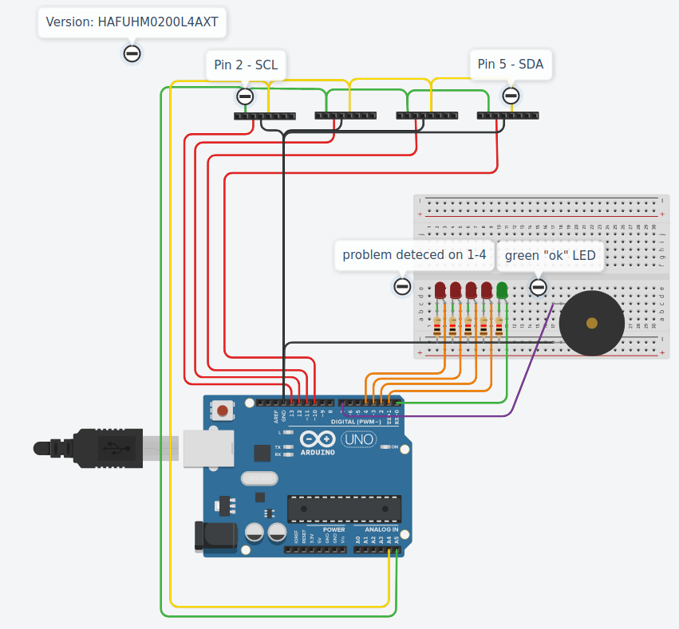
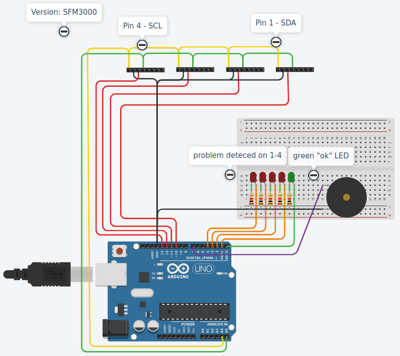
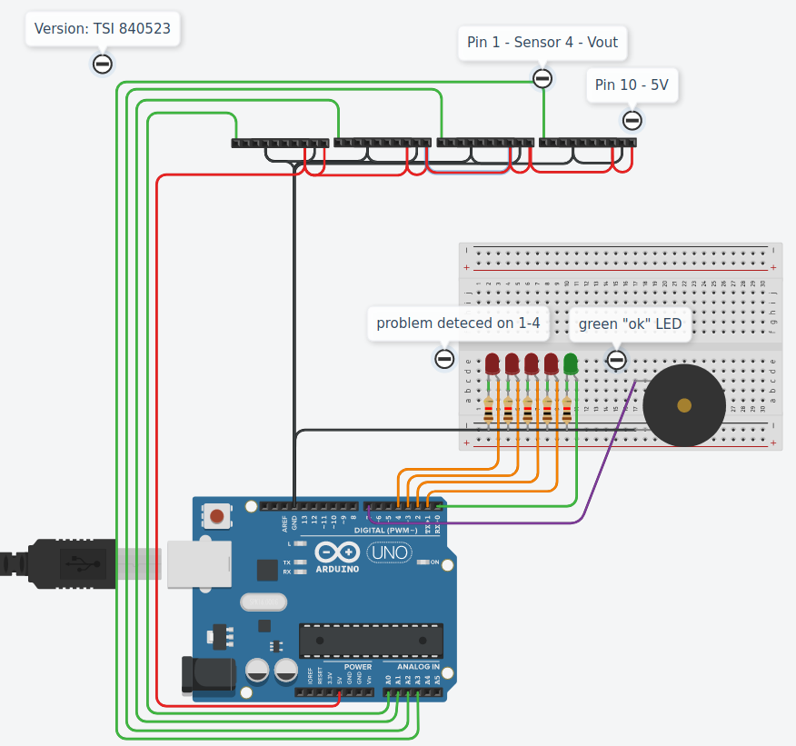

# Adding airflow controll to single ventilator multiple patient setup
## !!!Needs testing!!!
## TODO before testing:
TODO Basic Programming

TODO Testprinting Connectors

TODO Testing

## Abstract
This is a project to supply some additional options and hopefully safety to the idear of hooking more than one person up to a ventilator in crisis situations.
The Idear behind this idear: [link to Paper](https://onlinelibrary.wiley.com/doi/epdf/10.1197/j.aem.2006.05.009) - [link to YouTube](https://www.youtube.com/watch?v=uClq978oohY)  
The addition is a low-cost, easy to understand, build and use system to monitor that all patients get enough air.
This is done using flow sensors inside the Adapter construction.

## preparation 

### Needed materials:
* 2-4 x Sensors Type: HAFUHM0200L4AXT, SFM3000 or TSI 840523 (per patient)
* 1 x Arduino Uno (easily adaptable for Duo, Leonardo, Mega2560, Nano etc.)
* 1 x 5V Powersupply (via USB, can be phone charger)
* 1 x Peizo buzzer (broad range available)
* wires
* 1 x [recomended] green LED + 150 Ohm resistor
* 2-4 x [optional] RED LED + 150 Ohm resistor
* 1 x a few gramm of Filament (for example PLA)
* 1 x [recomende] Breadboard

### needed tools
* 3D-Printer (to Produce Coupling)
* Computer (to Programm the Arduino (this is simple, and can be done by nearly anyone))
* a soldering iron [can be avoided somehow if using a bread board, and tinkering]

## Mechanical works
Start by printing the coupling, as this will take some time, and offers you the possibility to work on other parts in the printing time.

Choose the coupler out of the "3D-Parts" Folder.
They should fit the **EN ISO 5356-1:2015** standard tubing, check before using! Also check before printing to many.

For example if your tubing is 15 mm in diameter use a 15yyyCoupler.stl for printing. 22 mm -> 22yyyCoupling.stl

The second part is determind by the Sensor you bought.
So Choose xxISOCoupling.stl for the HAFUHM0200L4AXT or SFM3000 Sensor as they are ISO 5356 conform.
Choose xxTSICoupling if you use the TSI Sensor.

Print all with 0.4mm nossle and extrusion width set to 0.4mm or 0.39mm if that works better. With this setting all walls will be at least 3 path wide.

## Programming
This Software is **UNTESTED** 

## Assembling
HAFUHM0200L4AXT Version: 
Link to Changeble Source: [TinkerCad - Version: HAFUHM0200L4AXT](https://www.tinkercad.com/things/ix4kOxAtABl-hafscematic/editel?sharecode=EwvW72o5Fr11amaMbfWzOQjrWkyNToyT3YVxdhOI21M=)  

SFM3000 Version: 
Link to Changeble Source: [TinkerCad - Version: SFM3000](https://www.tinkercad.com/things/1H1ZNrGPdKH-sfm3000scematic/editel?sharecode=2mnnRzKcG7YKSY-Uylg2WfmKUnSIyuF0voTbONE4A2A=)  

TSI 840523 Version: 
Link to Changeble Source: [TinkerCad - Version: TSI840523](https://www.tinkercad.com/things/jGp9jx15Z1a-copy-of-hafscematic/editel?tenant=circuits?sharecode=YZ4bZ7YgZwk-vGXiFbsnyXOgjhkVYRNfvazvrGywiu0=)  

## working on this project
Feel free to contribute, all parts are done by me and are published under the MIT licence. 
Furthermore they are all crated using free software.
* CAD-Rawdata available for FreeCAD
* Electrical Data available in TinkerCAD (not Open Source, like KiCAD but probably easier to understand for everyone)
* Programming done using the Arduino IDE

This Project is part of the #WirVSVirusHackaton and therefore done in a rush.